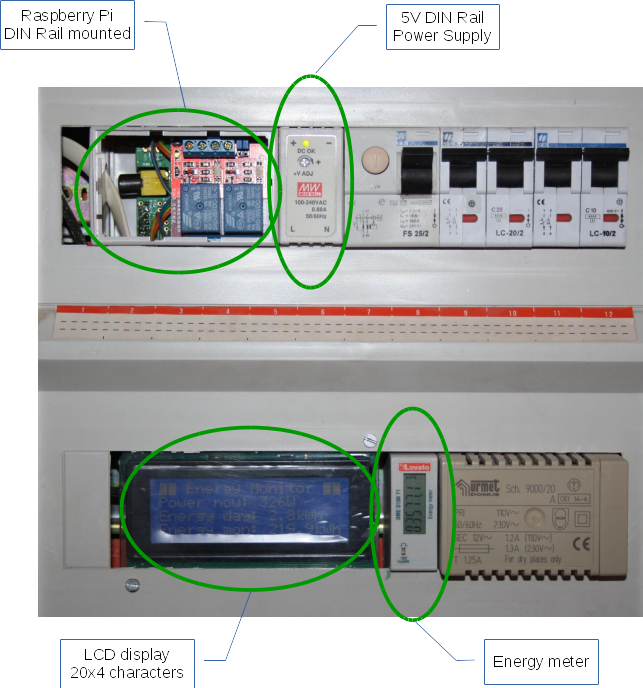
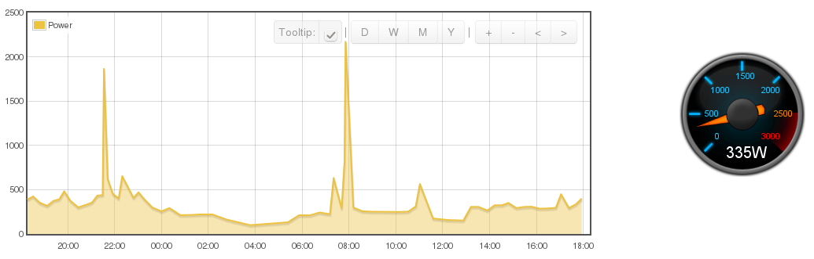
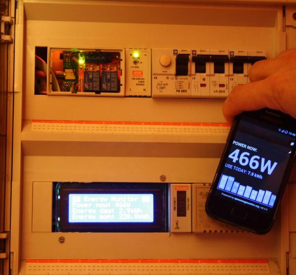

# emond
#### Smart Energy Monitor

### About
This software implements a Smart Energy Monitor to be run on the RaspberryPi. In short, it is a simplified version of a combination of the *emonTX*, *emonGLCD* and *emonBase* modules, developed by the OpenEnergyMonitor project (http://openenergymonitor.org). It is a pure software solution and doesn't require any additional hardware modules to be added.  

It connects to an energy meter via the S0 (pulse) interface and measures/calculates the instant power consumption as well as the electrical energy on daily and monthly basis. The data is sent to EmonCMS (http://emoncms.org) which is the Web server used by the OpenEnergyMonitor project. EmonCMS can then be deployed to further process your data (store, manipulate, chart, ...).  

The easiest way to display the energy data is to use the "My Electrics" appliance in EmonCMS.  

A local LCD display is supported to have instant access to the latest measurements.  

Here is a sample project which was realised with the **emond** software.  It is installed in the main electrical switchboard.
 
 

 

### Features
- Instant power measurement using energy meter pulses
- Daily and monthly energy calculation
- Periodic saving of energy counters to persistant storage and restoring at restart
- Filtering of short glitches and false pulses on the pulse counting GPIO line
- Display of measurements on local LCD display (via integrated lcdproc client)
- Transmission of measurements to EmonCMS (via WebAPI)
- Full compatibility with "My Electric" appliance in EmonCMS
- Easy customization of parameters via configuration file  
- Configurable WebAPI update rate limit
 

### Nice to have (wishlist)
- Alarm generation when approaching maximum power consumption
- Display daily/monthly energy cost
- Command line tool for reading current power values and energy counters
- Support for Energy meters with Modbus interface
- Support for 1-wire temperatue sensor  
 

### Hardware modules
#### Raspberry Pi
As base module a Raspberry Pi is used to run the software. This dependency is derived from the use of the wiringPi library which greatly simplifies the GPIO handling. However, if the GPIO programming is ported to a standard framework like Linux GPIO sysfs, then **emond** should be able to run also on other embedded Linux boards.  

#### Energy meter
Since **emond** uses the pulse counting method to calculate the instant power and electrical energy, an energy meter with a pulse output has to be used. There are basically two methods:  
- optical pulse counting (via energy meters LED)
- electrical pulse counting (via energy meters S0 interface)

For more info on pulse counting see http://openenergymonitor.org/emon/buildingblocks/introduction-to-pulse-counting.  

**emond** is being developed and tested with this type of simple energy meter that was installed in addition to the one provided by the energy company:  

The cabling has to be done as follows:
- S0- output on energy meter to GND on RaspberryPi
- S0+ output on energy meter to GPIO[x] on RaspberryPi  

No external pullup resistor for the S0+ line is required as the RPi internal pullup will be enabled by the software.  
 

#### LCD display
The LCD display is optional. It is controlled via the *lcdproc* software. **emond** implements an lcdproc client which sends its data to lcdproc which eventually displays the data on the LCD. Therefore any display supported by lcdproc can be used. However **emond** is optimised for a 20x4 character display such this one:

On the RaspberryPi, [lcdproc](http://www.lcdproc.org) supports this kind of display connected via the GPIO lines. For the wiring of the display to the GPIO pins see the lcdproc documentation.  
 

### Screenshot

This is a screenshot of the EmonCMS dashboard, showing a daily power consumption chart and the current power in a gauge.  

And this is the EmonCMS MyElectric Web application (which looks really good on a Smartphone).  

 

The electrical switchboard with the Smarphone running the EmonCMS MyElectric Web application.

 

### Installation

If you don't have a cross compile environment for the RaspberryPi installed on your PC, it is easiest to build the software directly on the RaspberryPi. Follow theses simple steps from the RPi console. Make sure you have the necessary packages installed (e.g. git).  

* Install the wiringPi library :  
Follow the instructions on the projects home page: http://wiringpi.com/download-and-install  

* Install CURL library :  
<pre>
    sudo apt-get install libcurl4-gnutls-dev
</pre>

* Clone git repository :  
<pre>
    git clone https://github.com/ondrej1024/emond
    cd emond
</pre>

* Alternatively get latest source code version :  
<pre>
    wget https://github.com/ondrej1024/emond/archive/master.zip
    unzip master.zip
    cd emond-master
</pre>

* Build and install :  
<pre>
    make
    sudo make install
</pre>

* Install lcdproc :  
**emond** needs the LCDd server from the lcdproc project (http://www.lcdproc.org) to be installed and running on your system if you want to display the measurements on a local LCD diplay. However, emond can also be used without local display.  
<pre>
    sudo apt-get install lcdproc
</pre>
Then you need to configure the lcdproc server LCDd according to your display via its configuration file LCDd.conf  
 

### Configuration

You can customize the application to your needs via the config file emon.conf which should be placed in the /etc/ system folder. An example file is provided together with the programs source code.  

<pre>
# Pulse counter specific parameters
################################################
[counter]
pulse_input_pin = 25    # BCM pin number used for pulse input from energy meter
wh_per_pulse    = 100   # Wh per pulse (Energy meter setting)
pulse_length    = 100   # pulse length (in ms), leave blank for auto detection
max_power       = 3300  # max possible power (in W) provided by energy company

# Storage parameters
################################################
[storage]
flash_dir = /media/data # Folder for permanent (writable) storage

# LCD display specific parameters
################################################
[lcd]
lcdproc_port =  # Specify this if not using default lcdproc port

# WebAPI specific parameters
################################################
[webapi]
api_base_uri = http://emoncms.org # Public EmonCMS server
api_key      = 1234567890  # Personal EmonCMS API key 
api_update_rate = 20       # min delay (in s) between 2 API requests
node_number  = 1           # Identifier of your node in EmonCMS
</pre>

 

### Run the program

During the installation process, an init script is automatically installed in /etc/init.d/ Therefore the emond program can be started via the following command:
<pre>
    sudo service emon start
</pre>

If you want to autostart the program at every system reboot (recommended), issue the following command:
<pre>
    sudo update-rc.d emon defaults
</pre>

### Running a second instance

To run multiple instances of emond, a suffix to identify the second and all subsequent instances can be provided as command line parameter, e.g. `hp1` for "Heat Pump #1". The full name of the instance will be `emon-hp1`

Customize the instance via its config file emon-hp1.conf which should be placed in the /etc/ system folder (see *Configuration* section above)

Create the init script to launch the instance by copying the original emond init script which was installed in /etc/init.d/ :

<pre>
    cd /etc/init.d
    sudo cp emon emon-hp1
</pre>

Change the three following lines of the init script according to the name assigned to the new instance :
<pre>
    # Provides:          emond-hp1
    PIDFILE=/var/run/$NAME-hp1.pid
    OPTS=hp1
</pre>

Start the new instance with the following command:
<pre>
    sudo service emon-hp1 start
</pre>

If you want to autostart the new instance at every system reboot (recommended), issue the following command:
<pre>
    sudo update-rc.d emon-hp1 defaults
</pre>

**Warning**: Named instances do not support the local LCD display, since they would interfere with the main instance of the program, which is the only one allowed to use it.

### Contributing

Any contribution like feedback, bug reports or code proposals are welcome and highly encouraged.  
Get in touch by e-mail to ondrej.wisniewski (at) gmail.com  or send a pull request. Thanks.

